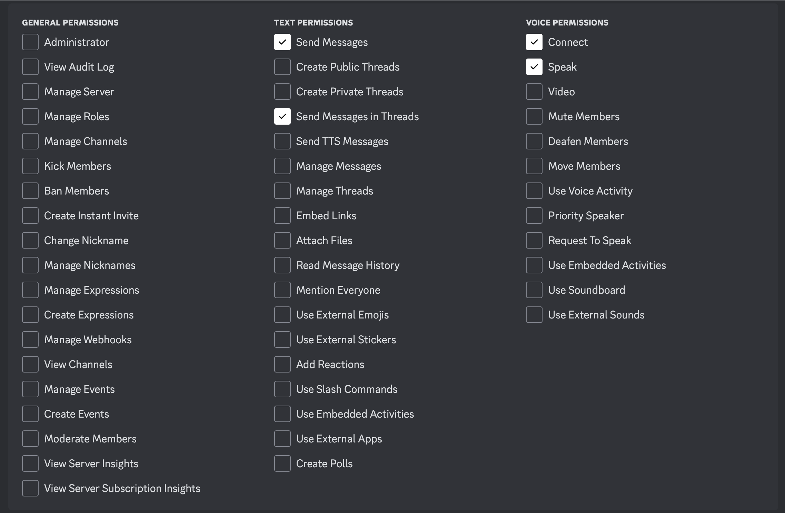

# Creating a Discord bot

To create a bot in Discord's developer portal, follow [this guide](https://discordpy.readthedocs.io/en/stable/discord.html).

For step 6 in the linked guide, modify the bot's permissions to match these:
